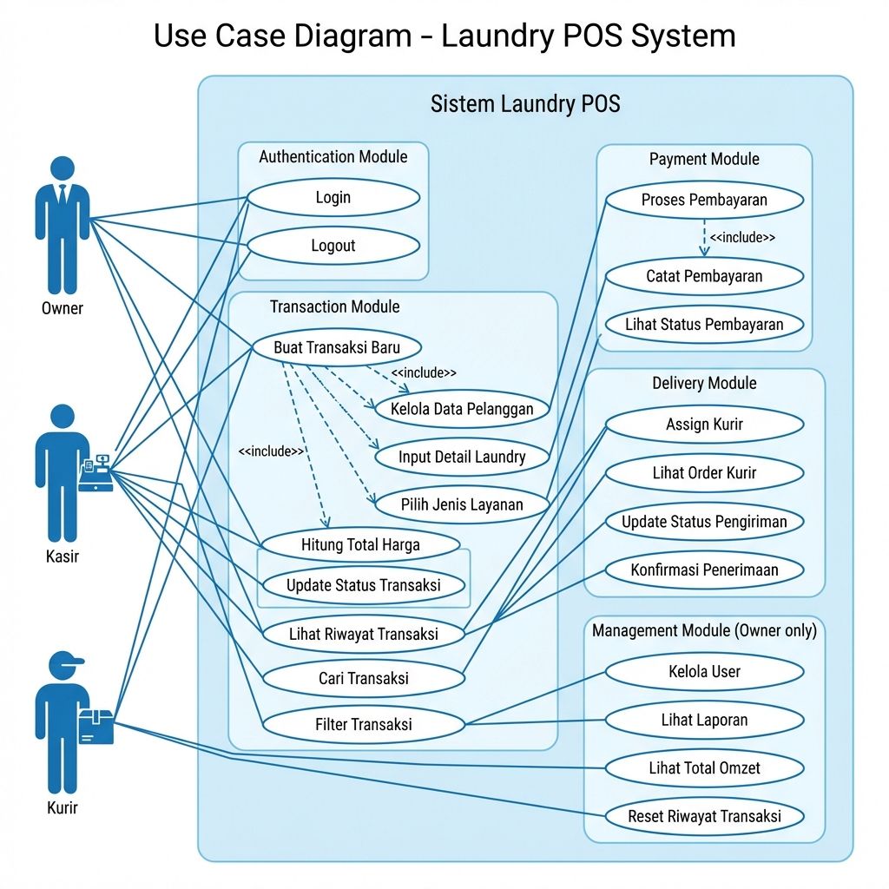
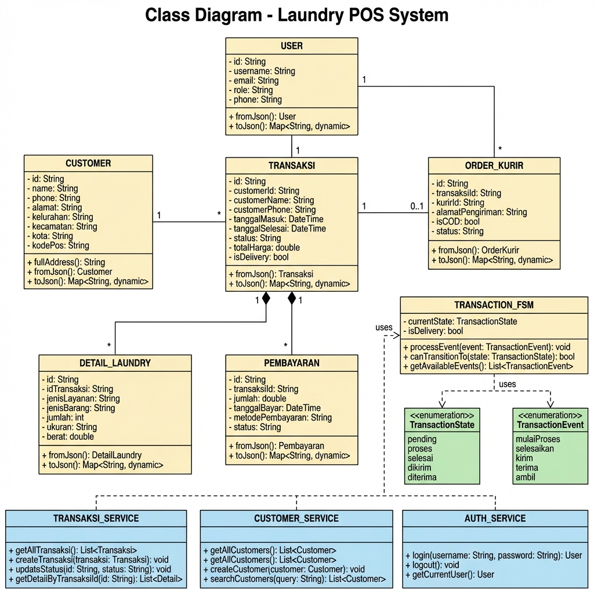
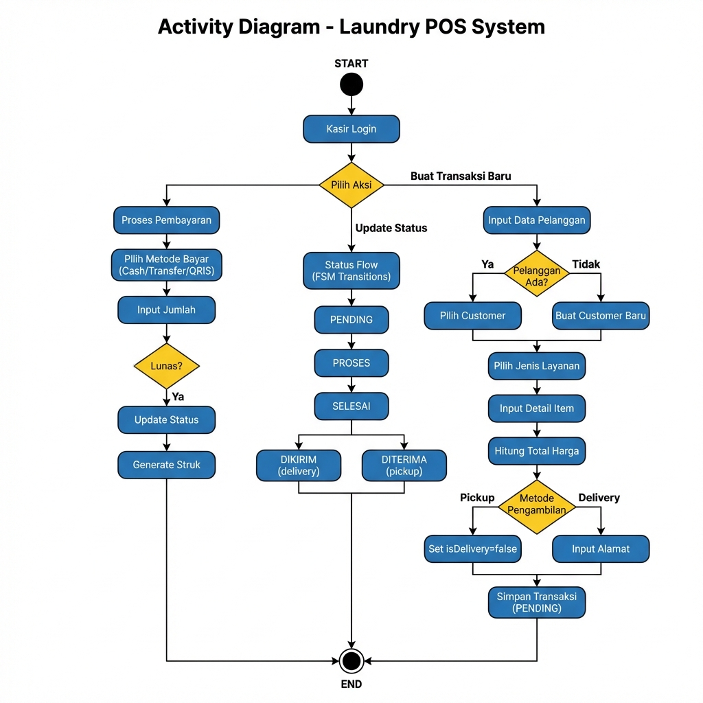

# Dokumentasi Diagram - Laundry POS System

Folder ini berisi dokumentasi diagram UML untuk aplikasi Laundry POS System.

---

## Daftar Diagram

### 1. Use Case Diagram
Menggambarkan interaksi antara aktor (Owner, Kasir, Kurir) dengan sistem.

| File | Deskripsi |
|------|-----------|
| [use_case_diagram.md](./use_case_diagram.md) | Diagram dalam format Mermaid + dokumentasi lengkap |
| [use_case_diagram.png](./use_case_diagram.png) | Gambar visual diagram |



---

### 2. Class Diagram
Menggambarkan struktur kelas dalam aplikasi, termasuk model data, service layer, dan FSM.

| File | Deskripsi |
|------|-----------|
| [class_diagram.md](./class_diagram.md) | Diagram dalam format Mermaid + dokumentasi lengkap |
| [class_diagram.png](./class_diagram.png) | Gambar visual diagram |



---

### 3. Activity Diagram
Menggambarkan alur kerja utama dalam sistem, termasuk proses transaksi, pembayaran, dan pengiriman.

| File | Deskripsi |
|------|-----------|
| [activity_diagram.md](./activity_diagram.md) | Diagram dalam format Mermaid + dokumentasi lengkap |
| [activity_diagram.png](./activity_diagram.png) | Gambar visual diagram |



---

## Ringkasan Sistem

### Aktor dalam Sistem
| Aktor | Deskripsi | Dashboard |
|-------|-----------|-----------|
| **Owner** | Pemilik bisnis laundry | Manajemen user, laporan, omzet |
| **Kasir** | Operator yang menangani transaksi | Buat transaksi, update status, pembayaran |
| **Kurir** | Pengirim pesanan delivery | Lihat order, update pengiriman |

### Finite State Machine (FSM) - Status Transaksi

#### Alur Pickup (Ambil di Tempat)
```
PENDING → PROSES → SELESAI → DITERIMA
```

#### Alur Delivery (Pengiriman)
```
PENDING → PROSES → SELESAI → DIKIRIM → DITERIMA
```

### Transisi yang Valid

| Current Status | Event | Next Status | Keterangan |
|---------------|-------|-------------|------------|
| PENDING | mulaiProses | PROSES | Mulai proses cucian |
| PROSES | selesaikan | SELESAI | Cucian selesai |
| SELESAI | ambil | DITERIMA | Customer ambil (pickup) |
| SELESAI | kirim | DIKIRIM | Dikirim oleh kurir (delivery) |
| DIKIRIM | terima | DITERIMA | Customer terima (delivery) |

---

## Teknologi yang Digunakan

- **Framework**: Flutter
- **Database**: Supabase (PostgreSQL)
- **State Management**: Provider
- **FSM Implementation**: Custom TransactionFSM class

---

## Catatan

Semua diagram dibuat berdasarkan implementasi aktual dari kode sumber aplikasi Laundry POS yang berlokasi di folder `lib/`.
