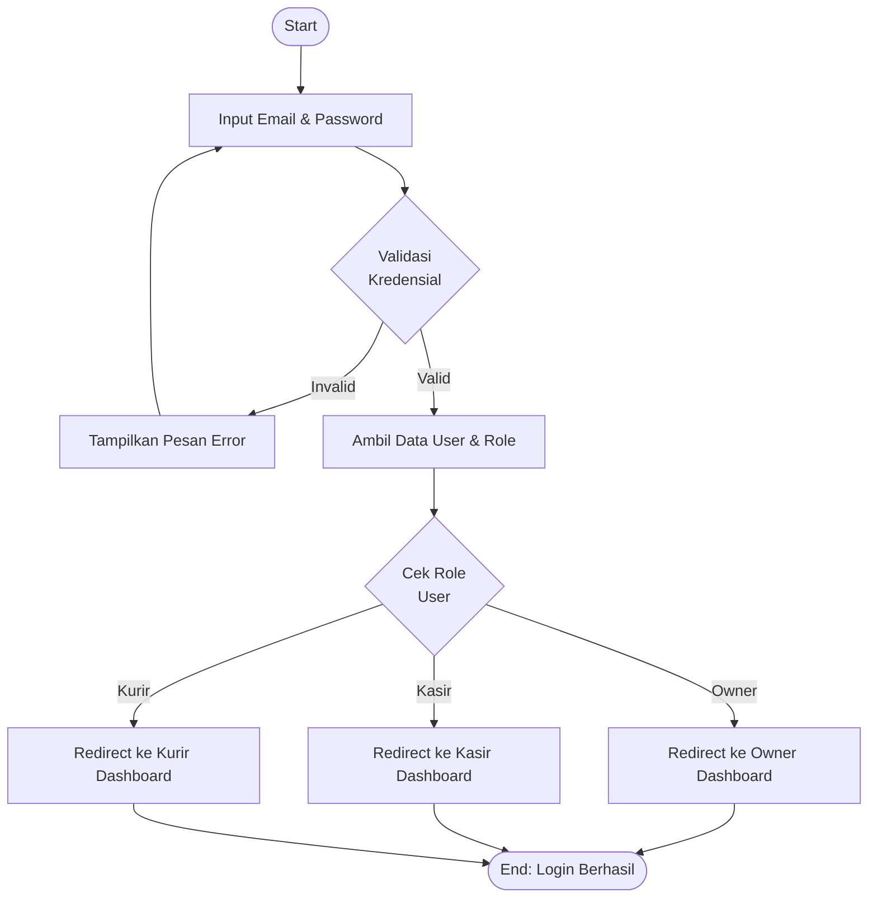
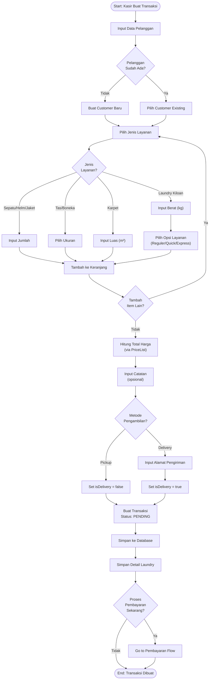
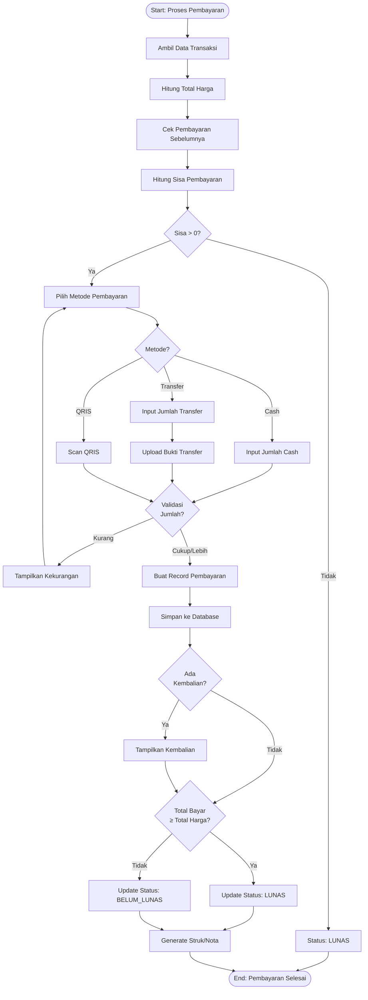
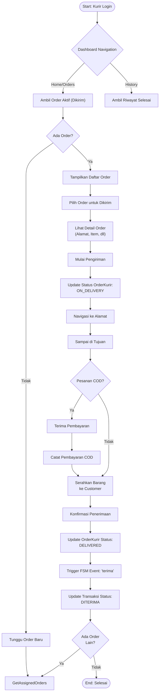
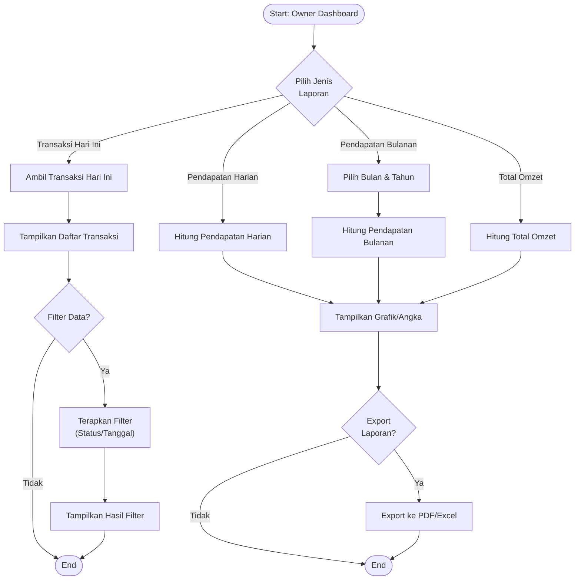
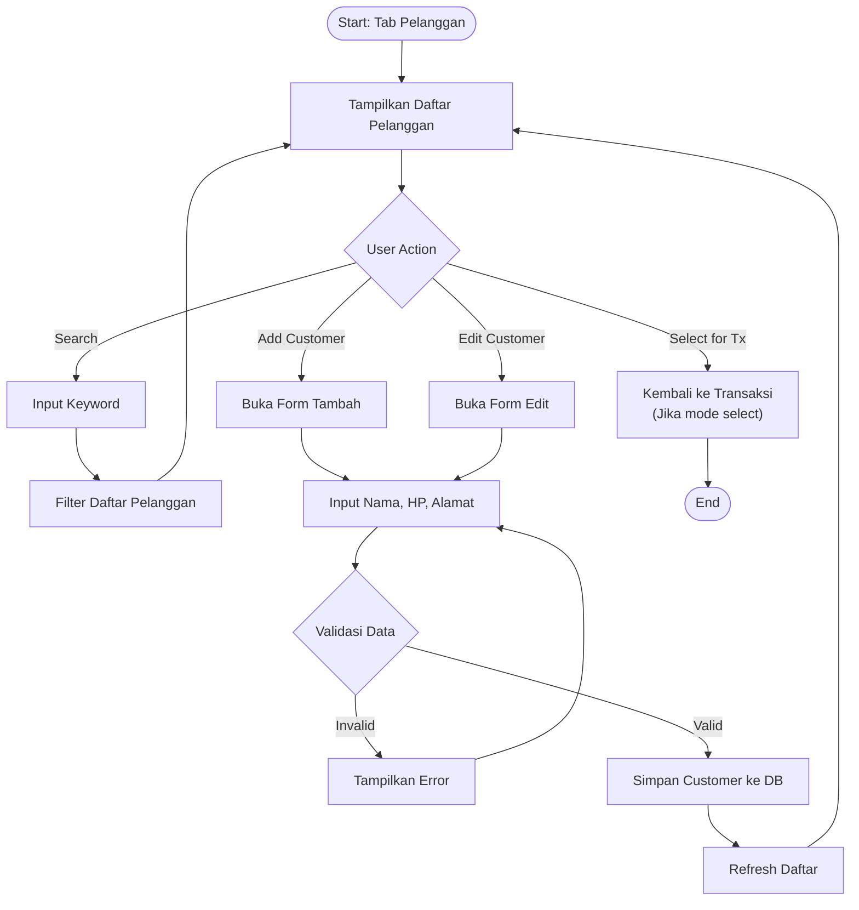

# Activity Diagram - Laundry POS System

## Deskripsi
Activity Diagram ini menggambarkan alur kerja utama dalam sistem Laundry POS, termasuk alur transaksi, pembayaran, dan pengiriman.

---

## 1. Activity Diagram: Proses Login



---

## 2. Activity Diagram: Buat Transaksi Baru (Kasir)



---

## 3. Activity Diagram: Alur Status Transaksi dengan FSM

```mermaid
flowchart TD
    Start([Start: Transaksi Baru]) --> InitFSM["Initialize TransactionFSM\n(status: PENDING)"]
    
    InitFSM --> StatusPending["📋 Status: PENDING\nMenunggu Diproses"]
    
    StatusPending --> TriggerMulai["Kasir: Trigger Event\n'mulaiProses'"]
    TriggerMulai --> ValidateMulai{"FSM Validate\nTransition?"}
    ValidateMulai -->|Invalid| RejectMulai["Reject: Transisi Tidak Valid"]
    RejectMulai --> StatusPending
    
    ValidateMulai -->|Valid| TransitionProses["FSM: Transition\nPENDING → PROSES"]
    TransitionProses --> UpdateDBProses["Update Database\n& Activity Log"]
    UpdateDBProses --> StatusProses["🔄 Status: PROSES\nSedang Dicuci"]
    
    StatusProses --> TriggerSelesai["Kasir: Trigger Event\n'selesaikan'"]
    TriggerSelesai --> ValidateSelesai{"FSM Validate?"}
    ValidateSelesai -->|Invalid| RejectSelesai["Reject"]
    RejectSelesai --> StatusProses
    
    ValidateSelesai -->|Valid| TransitionSelesai["FSM: Transition\nPROSES → SELESAI"]
    TransitionSelesai --> UpdateDBSelesai["Update Database\n& Activity Log"]
    UpdateDBSelesai --> StatusSelesai["✅ Status: SELESAI\nSiap Diambil/Kirim"]
    
    StatusSelesai --> CheckDelivery{"isDelivery?"}
    
    %% Pickup Flow
    CheckDelivery -->|Pickup| TriggerAmbil["Customer Ambil\nTrigger: 'ambil'"]
    TriggerAmbil --> TransitionDiterima1["FSM: Transition\nSELESAI → DITERIMA"]
    TransitionDiterima1 --> UpdateDBDiterima1["Update Database"]
    UpdateDBDiterima1 --> StatusDiterimaPickup["📦 Status: DITERIMA\n(Pickup Complete)"]
    
    %% Delivery Flow
    CheckDelivery -->|Delivery| AssignKurir["Assign Kurir ke Order"]
    AssignKurir --> CreateOrderKurir["Buat Record OrderKurir"]
    CreateOrderKurir --> TriggerKirim["Trigger Event: 'kirim'"]
    TriggerKirim --> TransitionDikirim["FSM: Transition\nSELESAI → DIKIRIM"]
    TransitionDikirim --> UpdateDBDikirim["Update Database"]
    UpdateDBDikirim --> StatusDikirim["🚚 Status: DIKIRIM\nDalam Pengiriman"]
    
    StatusDikirim --> KurirDeliver["Kurir Kirim Pesanan"]
    KurirDeliver --> TriggerTerima["Kurir: Trigger Event\n'terima'"]
    TriggerTerima --> TransitionDiterima2["FSM: Transition\nDIKIRIM → DITERIMA"]
    TransitionDiterima2 --> UpdateDBDiterima2["Update Database\n& OrderKurir Status"]
    UpdateDBDiterima2 --> StatusDiterimaDelivery["📦 Status: DITERIMA\n(Delivery Complete)"]
    
    StatusDiterimaPickup --> FinalState["🎉 Final State\nTransaksi Selesai"]
    StatusDiterimaDelivery --> FinalState
    
    FinalState --> End([End])
```



---

## 4. Activity Diagram: Proses Pembayaran



---

## 5. Activity Diagram: Alur Kurir



---

## 6. Activity Diagram: Owner - Lihat Laporan



---

## 7. Activity Diagram: Kelola Pelanggan (Kasir)



---

## Ringkasan Alur Bisnis

### Alur Transaksi Pickup
```
Buat Transaksi → PENDING → Mulai Proses → PROSES → Selesaikan → SELESAI → Customer Ambil → DITERIMA ✓
```

### Alur Transaksi Delivery
```
Buat Transaksi → PENDING → Mulai Proses → PROSES → Selesaikan → SELESAI → Assign Kurir → DIKIRIM → Customer Terima → DITERIMA ✓
```

### Status Pembayaran
```
PENDING → (Bayar Sebagian) → BELUM_LUNAS → (Bayar Sisa) → LUNAS ✓
```

### Status Order Kurir
```
ASSIGNED → ON_DELIVERY → DELIVERED → COMPLETED ✓
```
