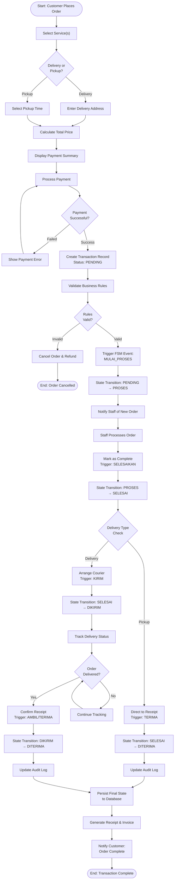

# Activity Diagram - Laundry POS Transaction Flow

```mermaid
graph TD
    Start([Start: Customer Places Order]) --> SelectService["Select Service(s)"]
    SelectService --> SelectDelivery{"Delivery or<br/>Pickup?"}
    
    SelectDelivery -->|Delivery| EnterDeliveryAddr["Enter Delivery Address"]
    SelectDelivery -->|Pickup| SelectPickupTime["Select Pickup Time"]
    
    EnterDeliveryAddr --> CalcPrice["Calculate Total Price"]
    SelectPickupTime --> CalcPrice
    
    CalcPrice --> ShowPayment["Display Payment Summary"]
    ShowPayment --> ProcessPayment["Process Payment"]
    
    ProcessPayment --> PaymentCheck{"Payment<br/>Successful?"}
    PaymentCheck -->|Failed| RetryPayment["Show Payment Error"]
    RetryPayment --> ProcessPayment
    
    PaymentCheck -->|Success| CreateTransaction["Create Transaction Record<br/>Status: PENDING"]
    
    CreateTransaction --> ValidateRules["Validate Business Rules"]
    ValidateRules --> RulesCheck{"Rules<br/>Valid?"}
    
    RulesCheck -->|Invalid| CancelOrder["Cancel Order & Refund"]
    CancelOrder --> End1([End: Order Cancelled])
    
    RulesCheck -->|Valid| TriggerFSM["Trigger FSM Event:<br/>MULAI_PROSES"]
    TriggerFSM --> TransitionPROSES["State Transition: PENDING → PROSES"]
    
    TransitionPROSES --> NotifyStaff["Notify Staff of New Order"]
    NotifyStaff --> StaffProcess["Staff Processes Order"]
    
    StaffProcess --> CompleteProcess["Mark as Complete<br/>Trigger: SELESAIKAN"]
    CompleteProcess --> TransitionSELESAI["State Transition: PROSES → SELESAI"]
    
    TransitionSELESAI --> CheckDeliveryType{"Delivery Type<br/>Check"}
    
    CheckDeliveryType -->|Pickup| DirectReceipt["Direct to Receipt<br/>Trigger: TERIMA"]
    DirectReceipt --> TransitionDITERIMA["State Transition: SELESAI → DITERIMA"]
    
    CheckDeliveryType -->|Delivery| ArrangeCourier["Arrange Courier<br/>Trigger: KIRIM"]
    ArrangeCourier --> TransitionDIKIRIM["State Transition: SELESAI → DIKIRIM"]
    
    TransitionDITERIMA --> UpdateAudit1["Update Audit Log"]
    TransitionDIKIRIM --> TrackDelivery["Track Delivery Status"]
    
    TrackDelivery --> DeliveryArrived{"Order<br/>Delivered?"}
    DeliveryArrived -->|No| WaitDelivery["Continue Tracking"]
    WaitDelivery --> DeliveryArrived
    
    DeliveryArrived -->|Yes| ConfirmReceipt["Confirm Receipt<br/>Trigger: AMBIL/TERIMA"]
    ConfirmReceipt --> TransitionFinal["State Transition: DIKIRIM → DITERIMA"]
    
    TransitionFinal --> UpdateAudit2["Update Audit Log"]
    UpdateAudit1 --> PersistState["Persist Final State<br/>to Database"]
    UpdateAudit2 --> PersistState
    
    PersistState --> GenerateReceipt["Generate Receipt & Invoice"]
    GenerateReceipt --> NotifyCustomer["Notify Customer:<br/>Order Complete"]
    
    NotifyCustomer --> End2([End: Transaction Complete])
```
