# Activity Diagram - Laundry POS System

## Deskripsi
Activity Diagram ini menggambarkan alur kerja utama dalam sistem Laundry POS, termasuk alur transaksi, pembayaran, dan pengiriman.

---

## 1. Activity Diagram: Proses Login


---

## 2. Activity Diagram: Buat Transaksi Baru (Kasir)

```mermaid
flowchart TD
    Start([Start: Kasir Buat Transaksi]) --> InputCustomer["Input Data Pelanggan"]
    
    InputCustomer --> CheckExisting{"Pelanggan\nSudah Ada?"}
    CheckExisting -->|Tidak| CreateCustomer["Buat Customer Baru"]
    CheckExisting -->|Ya| SelectCustomer["Pilih Customer Existing"]
    CreateCustomer --> PilihLayanan
    SelectCustomer --> PilihLayanan
    
    PilihLayanan["Pilih Jenis Layanan"]
    PilihLayanan --> CheckLayanan{"Jenis\nLayanan?"}
    
    CheckLayanan -->|Laundry Kiloan| InputBerat["Input Berat (kg)"]
    CheckLayanan -->|Sepatu/Helm/Jaket| InputJumlah["Input Jumlah"]
    CheckLayanan -->|Tas/Boneka| InputUkuran["Pilih Ukuran"]
    CheckLayanan -->|Karpet| InputLuas["Input Luas (m²)"]
    
    InputBerat --> PilihOpsi["Pilih Opsi Layanan\n(Reguler/Quick/Express)"]
    InputJumlah --> AddToCart
    InputUkuran --> AddToCart
    InputLuas --> AddToCart
    PilihOpsi --> AddToCart
    
    AddToCart["Tambah ke Keranjang"] --> MoreItems{"Tambah\nItem Lain?"}
    MoreItems -->|Ya| PilihLayanan
    MoreItems -->|Tidak| HitungTotal
    
    HitungTotal["Hitung Total Harga\n(via PriceList)"] --> InputCatatan["Input Catatan\n(opsional)"]
    
    InputCatatan --> PilihDelivery{"Metode\nPengambilan?"}
    PilihDelivery -->|Pickup| SetPickup["Set isDelivery = false"]
    PilihDelivery -->|Delivery| InputAlamat["Input Alamat Pengiriman"]
    InputAlamat --> SetDelivery["Set isDelivery = true"]
    
    SetPickup --> CreateTransaction
    SetDelivery --> CreateTransaction
    
    CreateTransaction["Buat Transaksi\nStatus: PENDING"] --> SaveToDatabase["Simpan ke Database"]
    
    SaveToDatabase --> SaveDetail["Simpan Detail Laundry"]
    SaveDetail --> ProsesPembayaran{"Proses\nPembayaran\nSekarang?"}
    
    ProsesPembayaran -->|Ya| GotoPembayaran["Go to Pembayaran Flow"]
    ProsesPembayaran -->|Tidak| End([End: Transaksi Dibuat])
    GotoPembayaran --> End
```



---

## 3. Activity Diagram: Alur Status Transaksi dengan FSM

```mermaid
flowchart TD
    Start([Start: Transaksi Baru]) --> InitFSM["Initialize TransactionFSM\n(status: PENDING)"]
    
    InitFSM --> StatusPending["📋 Status: PENDING\nMenunggu Diproses"]
    
    StatusPending --> TriggerMulai["Kasir: Trigger Event\n'mulaiProses'"]
    TriggerMulai --> ValidateMulai{"FSM Validate\nTransition?"}
    ValidateMulai -->|Invalid| RejectMulai["Reject: Transisi Tidak Valid"]
    RejectMulai --> StatusPending
    
    ValidateMulai -->|Valid| TransitionProses["FSM: Transition\nPENDING → PROSES"]
    TransitionProses --> UpdateDBProses["Update Database\n& Activity Log"]
    UpdateDBProses --> StatusProses["🔄 Status: PROSES\nSedang Dicuci"]
    
    StatusProses --> TriggerSelesai["Kasir: Trigger Event\n'selesaikan'"]
    TriggerSelesai --> ValidateSelesai{"FSM Validate?"}
    ValidateSelesai -->|Invalid| RejectSelesai["Reject"]
    RejectSelesai --> StatusProses
    
    ValidateSelesai -->|Valid| TransitionSelesai["FSM: Transition\nPROSES → SELESAI"]
    TransitionSelesai --> UpdateDBSelesai["Update Database\n& Activity Log"]
    UpdateDBSelesai --> StatusSelesai["✅ Status: SELESAI\nSiap Diambil/Kirim"]
    
    StatusSelesai --> CheckDelivery{"isDelivery?"}
    
    %% Pickup Flow
    CheckDelivery -->|Pickup| TriggerAmbil["Customer Ambil\nTrigger: 'ambil'"]
    TriggerAmbil --> TransitionDiterima1["FSM: Transition\nSELESAI → DITERIMA"]
    TransitionDiterima1 --> UpdateDBDiterima1["Update Database"]
    UpdateDBDiterima1 --> StatusDiterimaPickup["📦 Status: DITERIMA\n(Pickup Complete)"]
    
    %% Delivery Flow
    CheckDelivery -->|Delivery| AssignKurir["Assign Kurir ke Order"]
    AssignKurir --> CreateOrderKurir["Buat Record OrderKurir"]
    CreateOrderKurir --> TriggerKirim["Trigger Event: 'kirim'"]
    TriggerKirim --> TransitionDikirim["FSM: Transition\nSELESAI → DIKIRIM"]
    TransitionDikirim --> UpdateDBDikirim["Update Database"]
    UpdateDBDikirim --> StatusDikirim["🚚 Status: DIKIRIM\nDalam Pengiriman"]
    
    StatusDikirim --> KurirDeliver["Kurir Kirim Pesanan"]
    KurirDeliver --> TriggerTerima["Kurir: Trigger Event\n'terima'"]
    TriggerTerima --> TransitionDiterima2["FSM: Transition\nDIKIRIM → DITERIMA"]
    TransitionDiterima2 --> UpdateDBDiterima2["Update Database\n& OrderKurir Status"]
    UpdateDBDiterima2 --> StatusDiterimaDelivery["📦 Status: DITERIMA\n(Delivery Complete)"]
    
    StatusDiterimaPickup --> FinalState["🎉 Final State\nTransaksi Selesai"]
    StatusDiterimaDelivery --> FinalState
    
    FinalState --> End([End])
```



---

## 4. Activity Diagram: Proses Pembayaran

```mermaid
flowchart TD
    Start([Start: Proses Pembayaran]) --> GetTransaksi["Ambil Data Transaksi"]
    GetTransaksi --> GetTotalHarga["Hitung Total Harga"]
    
    GetTotalHarga --> GetExistingPayment["Cek Pembayaran Sebelumnya"]
    GetExistingPayment --> CalcSisa["Hitung Sisa Pembayaran"]
    
    CalcSisa --> CheckSisa{"Sisa > 0?"}
    CheckSisa -->|Tidak| AlreadyLunas["Status: LUNAS"]
    AlreadyLunas --> End([End])
    
    CheckSisa -->|Ya| PilihMetode["Pilih Metode Pembayaran"]
    PilihMetode --> CheckMetode{"Metode?"}
    
    CheckMetode -->|Cash| InputCash["Input Jumlah Cash"]
    CheckMetode -->|Transfer| InputTransfer["Input Jumlah Transfer"]
    CheckMetode -->|QRIS| InputQRIS["Scan QRIS"]
    
    InputCash --> ValidasiJumlah
    InputTransfer --> UploadBukti["Upload Bukti Transfer"]
    UploadBukti --> ValidasiJumlah
    InputQRIS --> ValidasiJumlah
    
    ValidasiJumlah{"Validasi\nJumlah?"}
    ValidasiJumlah -->|Kurang| ShowKurang["Tampilkan Kekurangan"]
    ShowKurang --> PilihMetode
    
    ValidasiJumlah -->|Cukup/Lebih| CreatePembayaran["Buat Record Pembayaran"]
    CreatePembayaran --> SavePembayaran["Simpan ke Database"]
    
    SavePembayaran --> HitungKembalian{"Ada\nKembalian?"}
    HitungKembalian -->|Ya| ShowKembalian["Tampilkan Kembalian"]
    HitungKembalian -->|Tidak| CheckLunas
    ShowKembalian --> CheckLunas
    
    CheckLunas{"Total Bayar\n≥ Total Harga?"}
    CheckLunas -->|Ya| UpdateStatusLunas["Update Status: LUNAS"]
    CheckLunas -->|Tidak| UpdateStatusBelumLunas["Update Status: BELUM_LUNAS"]
    
    UpdateStatusLunas --> GenerateReceipt["Generate Struk/Nota"]
    UpdateStatusBelumLunas --> GenerateReceipt
    
    GenerateReceipt --> End([End: Pembayaran Selesai])
```



---

## 5. Activity Diagram: Alur Kurir


---

## 6. Activity Diagram: Owner - Lihat Laporan


---

## 7. Activity Diagram: Kelola Pelanggan (Kasir)


---

## Ringkasan Alur Bisnis

### Alur Transaksi Pickup
```
Buat Transaksi → PENDING → Mulai Proses → PROSES → Selesaikan → SELESAI → Customer Ambil → DITERIMA ✓
```

### Alur Transaksi Delivery
```
Buat Transaksi → PENDING → Mulai Proses → PROSES → Selesaikan → SELESAI → Assign Kurir → DIKIRIM → Customer Terima → DITERIMA ✓
```

### Status Pembayaran
```
PENDING → (Bayar Sebagian) → BELUM_LUNAS → (Bayar Sisa) → LUNAS ✓
```

### Status Order Kurir
```
ASSIGNED → ON_DELIVERY → DELIVERED → COMPLETED ✓
```
