# Activity Diagram - Kurir (Courier)

## Deskripsi
Activity Diagram ini menggambarkan seluruh alur kerja **Kurir** dalam sistem Laundry POS Trias Laundry, mulai dari login hingga pengiriman pesanan dan penerimaan pembayaran COD.

---

## Activity Diagram: Alur Lengkap Kurir

```mermaid
flowchart TD
    Start([Start: Kurir]) --> Login[Login ke Sistem]
    Login --> ValidasiAuth{Validasi\nKredensial}
    
    ValidasiAuth -->|Invalid| ErrorLogin[Tampilkan Error Login]
    ErrorLogin --> Login
    
    ValidasiAuth -->|Valid| DashboardKurir[Dashboard Kurir]
    
    DashboardKurir --> MenuPilihan{Pilih Menu}
    
    %% MENU LIHAT ORDER PENGIRIMAN
    MenuPilihan -->|Orders Tab| LihatOrderAktif[Ambil Order Aktif\nStatus: DIKIRIM]
    LihatOrderAktif --> CekAdaOrder{Ada Order\nyang Ditugaskan?}
    
    CekAdaOrder -->|Tidak| TungguOrder[Tampilkan: Tidak Ada Order]
    TungguOrder --> DashboardKurir
    
    CekAdaOrder -->|Ya| TampilkanDaftarOrder[Tampilkan Daftar Order]
    TampilkanDaftarOrder --> PilihOrder[Pilih Order untuk Dikirim]
    
    PilihOrder --> LihatDetailOrder[Lihat Detail Order]
    LihatDetailOrder --> TampilkanInfo[Tampilkan Info:\n- Nama Pelanggan\n- Alamat Lengkap\n- Total Tagihan\n- Metode Pembayaran]
    
    TampilkanInfo --> MulaiPengiriman[Klik: Mulai Pengiriman]
    MulaiPengiriman --> UpdateStatusOnDelivery[Update OrderKurir Status:\nON_DELIVERY]
    
    UpdateStatusOnDelivery --> NavigasiAlamat[Navigasi ke Alamat\nvia Peta Google Maps]
    NavigasiAlamat --> SampaiTujuan[Sampai di Lokasi Pelanggan]
    
    SampaiTujuan --> CekMetodePembayaran{Metode\nPembayaran?}
    
    %% JIKA COD
    CekMetodePembayaran -->|COD| TerimaPembayaranCOD[Terima Pembayaran Tunai]
    TerimaPembayaranCOD --> InputJumlahCOD[Input Jumlah yang Diterima]
    InputJumlahCOD --> UploadBuktiFoto[Upload Bukti Foto Opsional]
    UploadBuktiFoto --> CatatPembayaranCOD[Catat Pembayaran COD\nStatus: Menunggu Verifikasi Owner]
    CatatPembayaranCOD --> SerahkanBarang
    
    %% JIKA SUDAH LUNAS/METODE LAIN
    CekMetodePembayaran -->|Sudah Lunas/Transfer/QRIS| SerahkanBarang[Serahkan Laundry\nke Pelanggan]
    
    SerahkanBarang --> KonfirmasiPenerimaan[Konfirmasi Penerimaan\ndari Pelanggan]
    KonfirmasiPenerimaan --> KlikSelesaikanPengiriman[Klik: Selesaikan Pengiriman]
    
    KlikSelesaikanPengiriman --> UpdateOrderKurirDelivered[Update OrderKurir Status:\nDELIVERED]
    UpdateOrderKurirDelivered --> TriggerFSMTerima[Trigger FSM Event: terima]
    TriggerFSMTerima --> UpdateTransaksiDiterima[Update Transaksi Status:\nDITERIMA]
    
    UpdateTransaksiDiterima --> PengirimanSelesai[Pengiriman Selesai]
    PengirimanSelesai --> CekOrderLain{Ada Order\nLain?}
    
    CekOrderLain -->|Ya| LihatOrderAktif
    CekOrderLain -->|Tidak| DashboardKurir
    
    %% MENU RIWAYAT PENGIRIMAN
    MenuPilihan -->|History Tab| LihatRiwayatPengiriman[Ambil Riwayat Order\nStatus: DITERIMA]
    LihatRiwayatPengiriman --> TampilkanRiwayat[Tampilkan Daftar\nOrder yang Sudah Selesai]
    
    TampilkanRiwayat --> PilihRiwayat{Pilih Order\nuntuk Detail?}
    PilihRiwayat -->|Ya| LihatDetailRiwayat[Lihat Detail Order]
    PilihRiwayat -->|Tidak| DashboardKurir
    
    LihatDetailRiwayat --> TampilkanInfoRiwayat[Tampilkan Info:\n- Tanggal Pengiriman\n- Alamat\n- Total Tagihan\n- Bukti Penerimaan]
    TampilkanInfoRiwayat --> DashboardKurir
    
    %% LOGOUT
    MenuPilihan -->|Logout| LogoutKurir[Logout dari Sistem]
    LogoutKurir --> End([End: Session Berakhir])
```



---

## Ringkasan Use Cases Kurir

1. **UC-01**: Login ke Sistem
2. **UC-02**: Logout dari Sistem
3. **UC-12**: Lihat Order Pengiriman
4. **UC-13**: Mulai Pengiriman
5. **UC-14**: Update Status Pengiriman
6. **UC-15**: Terima Pembayaran COD
7. **UC-16**: Lihat Riwayat Pengiriman

---

## Alur Status Order Kurir

```
ASSIGNED → ON_DELIVERY → DELIVERED → (Transaksi: DITERIMA)
```

## Navigasi Tab Dashboard Kurir

### Tab Orders (Active)
- Menampilkan order dengan status **DIKIRIM**
- Order yang sedang dalam pengiriman atau belum selesai

### Tab History (Riwayat)
- Menampilkan order dengan status **DITERIMA**
- Order yang sudah selesai dikirim

---

## Pembayaran COD

Jika order menggunakan metode pembayaran **COD** (Cash on Delivery):
1. Kurir menerima pembayaran tunai dari pelanggan
2. Kurir mencatat jumlah yang diterima di aplikasi
3. Kurir dapat upload bukti foto (opsional)
4. Pembayaran tersimpan dengan status **Menunggu Verifikasi**
5. **Owner** akan memverifikasi pembayaran COD tersebut
6. Setelah diverifikasi, status pembayaran berubah menjadi **LUNAS**
