# Activity Diagram - Owner

## Deskripsi
Activity Diagram ini menggambarkan seluruh alur kerja **Owner** dalam sistem Laundry POS Trias Laundry, mulai dari login hingga monitoring bisnis, kelola user, dan verifikasi pembayaran.

---

## Activity Diagram: Alur Lengkap Owner

```mermaid
flowchart TD
    Start([Start: Owner]) --> Login[Login ke Sistem]
    Login --> ValidasiAuth{Validasi\nKredensial}
    
    ValidasiAuth -->|Invalid| ErrorLogin[Tampilkan Error Login]
    ErrorLogin --> Login
    
    ValidasiAuth -->|Valid| DashboardOwner[Dashboard Owner]
    DashboardOwner --> LoadDashboard[Load Dashboard Analytics]
    
    LoadDashboard --> TampilkanMetrik[Tampilkan Metrik:\n- Total Omzet\n- Pendapatan Hari Ini\n- Jumlah Transaksi\n- Grafik Pendapatan]
    
    TampilkanMetrik --> MenuPilihan{Pilih Menu}
    
    %% MENU LIHAT DASHBOARD ANALITIK
    MenuPilihan -->|Dashboard| RefreshDashboard[Refresh Dashboard]
    RefreshDashboard --> HitungTotalOmzet[Hitung Total Omzet\ndari Semua Transaksi]
    HitungTotalOmzet --> HitungPendapatanHariIni[Hitung Pendapatan Hari Ini]
    HitungPendapatanHariIni --> HitungJumlahTransaksi[Hitung Jumlah Transaksi]
    HitungJumlahTransaksi --> GenerateGrafik[Generate Grafik Pendapatan\n7 Hari Terakhir]
    GenerateGrafik --> TampilkanMetrik
    
    %% MENU LIHAT LAPORAN
    MenuPilihan -->|Lihat Laporan| PilihJenisLaporan{Pilih Jenis\nLaporan}
    
    PilihJenisLaporan -->|Transaksi Hari Ini| GetTransaksiHariIni[Ambil Transaksi Hari Ini]
    GetTransaksiHariIni --> TampilkanDaftarTransaksiHariIni[Tampilkan Daftar Transaksi]
    
    PilihJenisLaporan -->|Pendapatan Bulanan| PilihBulan[Pilih Bulan & Tahun]
    PilihBulan --> HitungPendapatanBulanan[Hitung Pendapatan Bulanan]
    HitungPendapatanBulanan --> TampilkanGrafikBulanan
    
    PilihJenisLaporan -->|Total Omzet| TampilkanTotalOmzet[Tampilkan Total Omzet\nKeseluruhan]
    TampilkanTotalOmzet --> TampilkanGrafikBulanan
    
    TampilkanDaftarTransaksiHariIni --> FilterLaporan{Filter\nLaporan?}
    FilterLaporan -->|Ya| ApplyFilter[Filter: Status/Tanggal]
    ApplyFilter --> TampilkanHasilFilter[Tampilkan Hasil Filter]
    TampilkanHasilFilter --> ExportOption
    
    FilterLaporan -->|Tidak| ExportOption
    
    TampilkanGrafikBulanan[Tampilkan Grafik/Tabel Pendapatan] --> ExportOption{Export\nLaporan?}
    ExportOption -->|Ya| ExportLaporanPDF[Export ke PDF/Excel]
    ExportLaporanPDF --> DownloadLaporan[Download Laporan]
    DownloadLaporan --> DashboardOwner
    
    ExportOption -->|Tidak| DashboardOwner
    
    %% MENU VERIFIKASI PEMBAYARAN COD
    MenuPilihan -->|Verifikasi COD| GetPembayaranCOD[Ambil Daftar Pembayaran COD\nStatus: Menunggu Verifikasi]
    GetPembayaranCOD --> CekAdaCOD{Ada Pembayaran\nCOD?}
    
    CekAdaCOD -->|Tidak| TidakAdaCOD[Tidak Ada Pembayaran\nyang Perlu Diverifikasi]
    TidakAdaCOD --> DashboardOwner
    
    CekAdaCOD -->|Ya| TampilkanDaftarCOD[Tampilkan Daftar\nPembayaran COD]
    TampilkanDaftarCOD --> PilihCOD[Pilih Pembayaran untuk Verifikasi]
    
    PilihCOD --> LihatDetailCOD[Lihat Detail Pembayaran:\n- Transaksi\n- Kurir\n- Jumlah\n- Bukti Foto]
    
    LihatDetailCOD --> KeputusanVerifikasi{Keputusan}
    
    KeputusanVerifikasi -->|Verifikasi| KonfirmasiVerifikasi[Konfirmasi Verifikasi]
    KonfirmasiVerifikasi --> UpdateStatusLunas[Update Status Pembayaran:\nLUNAS]
    UpdateStatusLunas --> LogVerifikasi[Catat Log Verifikasi]
    LogVerifikasi --> NotifikasiVerifikasi[Notifikasi: Pembayaran Diverifikasi]
    NotifikasiVerifikasi --> DashboardOwner
    
    KeputusanVerifikasi -->|Tolak| InputAlasanPenolakan[Input Alasan Penolakan]
    InputAlasanPenolakan --> UpdateStatusDitolak[Update Status Pembayaran:\nDITOLAK]
    UpdateStatusDitolak --> LogPenolakan[Catat Log Penolakan]
    LogPenolakan --> NotifikasiPenolakan[Notifikasi: Pembayaran Ditolak]
    NotifikasiPenolakan --> DashboardOwner
    
    KeputusanVerifikasi -->|Batal| DashboardOwner
    
    %% MENU KELOLA USER
    MenuPilihan -->|Kelola User| TampilkanDaftarUser[Tampilkan Daftar User\nKasir & Kurir]
    TampilkanDaftarUser --> AksiUser{Pilih Aksi}
    
    AksiUser -->|Tambah User| BukaFormTambah[Buka Form Tambah User]
    BukaFormTambah --> InputDataUser[Input Data User:\n- Email\n- Password\n- Nama\n- Role Kasir/Kurir]
    
    AksiUser -->|Edit User| BukaFormEdit[Buka Form Edit User]
    BukaFormEdit --> InputDataUser
    
    InputDataUser --> ValidasiDataUser{Validasi\nData?}
    ValidasiDataUser -->|Invalid| ErrorUser[Tampilkan Error]
    ErrorUser --> InputDataUser
    
    ValidasiDataUser -->|Valid| SimpanUser[Simpan User via Supabase Auth]
    SimpanUser --> RefreshDaftarUser[Refresh Daftar User]
    RefreshDaftarUser --> TampilkanDaftarUser
    
    AksiUser -->|Aktif/Nonaktifkan| ToggleStatusUser[Toggle Status User]
    ToggleStatusUser --> UpdateStatusUser[Update Status User di Database]
    UpdateStatusUser --> RefreshDaftarUser
    
    AksiUser -->|Kembali| DashboardOwner
    
    %% MENU MONITORING KASIR & KURIR
    MenuPilihan -->|Monitoring| TampilkanMonitoring[Tampilkan Section Monitoring]
    TampilkanMonitoring --> GetDaftarKaryawan[Ambil Daftar Kasir & Kurir]
    GetDaftarKaryawan --> TampilkanStatusKaryawan[Tampilkan Status Karyawan:\n- Nama\n- Role\n- Status Aktif/Tidak Aktif\n- Aktivitas Terakhir]
    
    TampilkanStatusKaryawan --> RefreshMonitoring{Refresh\nMonitoring?}
    RefreshMonitoring -->|Ya| TampilkanMonitoring
    RefreshMonitoring -->|Tidak| DashboardOwner
    
    %% MENU RESET RIWAYAT TRANSAKSI (TESTING)
    MenuPilihan -->|Reset Riwayat| KonfirmasiReset[Tampilkan Dialog Konfirmasi]
    KonfirmasiReset --> InputKonfirmasiText[Input Teks Konfirmasi:\nKetik RESET atau sejenisnya]
    
    InputKonfirmasiText --> ValidasiKonfirmasi{Konfirmasi\nBenar?}
    ValidasiKonfirmasi -->|Tidak| BatalReset[Batal Reset]
    BatalReset --> DashboardOwner
    
    ValidasiKonfirmasi -->|Ya| HapusSemuaTransaksi[Hapus Semua Data:\n- Transaksi\n- Detail Laundry\n- Pembayaran\n- Order Kurir]
    HapusSemuaTransaksi --> ResetSelesai[Reset Berhasil]
    ResetSelesai --> DashboardOwner
    
    %% LOGOUT
    MenuPilihan -->|Logout| LogoutOwner[Logout dari Sistem]
    LogoutOwner --> End([End: Session Berakhir])
```

---

## Ringkasan Use Cases Owner

1. **UC-01**: Login ke Sistem
2. **UC-02**: Logout dari Sistem
3. **UC-17**: Lihat Dashboard Analitik
4. **UC-18**: Lihat Total Omzet
5. **UC-19**: Lihat Grafik Pendapatan
6. **UC-20**: Verifikasi Pembayaran COD
7. **UC-21**: Lihat Laporan
8. **UC-22**: Kelola User
9. **UC-23**: Monitoring Kasir & Kurir
10. **UC-24**: Reset Riwayat Transaksi

---

## Dashboard Metrics

Owner Dashboard menampilkan metrik utama:
- **Total Omzet**: Total pendapatan dari semua transaksi
- **Pendapatan Hari Ini**: Total pendapatan transaksi hari ini
- **Jumlah Transaksi**: Total transaksi yang tercatat
- **Grafik Pendapatan**: Visualisasi pendapatan 7 hari terakhir

---

## Jenis Laporan

### 1. Transaksi Hari Ini
- Daftar semua transaksi yang terjadi hari ini
- Dapat difilter berdasarkan status

### 2. Pendapatan Bulanan
- Pilih bulan dan tahun tertentu
- Melihat total pendapatan dan grafik bulanan

### 3. Total Omzet
- Total keseluruhan pendapatan
- Dari awal sistem digunakan hingga saat ini

---

## Verifikasi Pembayaran COD

Owner memiliki tanggung jawab untuk memverifikasi pembayaran COD yang diterima oleh Kurir:

1. Melihat daftar pembayaran COD yang menunggu verifikasi
2. Melihat detail:
   - Transaksi terkait
   - Kurir yang menerima pembayaran
   - Jumlah yang dibayarkan
   - Bukti foto (jika ada)
3. Keputusan:
   - **Verifikasi**: Pembayaran valid, status berubah menjadi LUNAS
   - **Tolak**: Pembayaran tidak valid, input alasan penolakan

---

## Kelola User

Owner dapat mengelola akun Kasir dan Kurir:
- **Tambah User Baru**: Buat akun baru dengan email, password, dan role
- **Edit User**: Ubah data user yang sudah ada
- **Aktif/Nonaktifkan User**: Toggle status user tanpa menghapus akun

---

## Monitoring Karyawan

Owner dapat memantau aktivitas karyawan:
- Melihat daftar semua Kasir dan Kurir
- Status aktif/tidak aktif
- Aktivitas terakhir setiap karyawan

---

## Reset Riwayat (Testing Only)

⚠️ **WARNING**: Fitur ini hanya untuk keperluan testing, bukan untuk production.

Menghapus semua data:
- Transaksi
- Detail Laundry
- Pembayaran
- Order Kurir

Memerlukan konfirmasi dengan mengetik teks tertentu untuk menghindari penghapusan tidak sengaja.
