# Class Diagram - Laundry POS System

## Deskripsi
Class Diagram ini menggambarkan struktur kelas dalam aplikasi Laundry POS, termasuk model data, service layer, dan Finite State Machine (FSM) untuk manajemen status transaksi.

---

## Class Diagram

```mermaid
classDiagram
    %% ==================== MODELS ====================
    class User {
        -String id
        -String username
        -String email
        -String role
        -String? phone
        +fromJson(Map~String,dynamic~ json) User
        +toJson() Map~String,dynamic~
    }

    class Customer {
        -String id
        -String name
        -String phone
        -String? alamat
        -String? kelurahan
        -String? kecamatan
        -String? kota
        -String? kodePos
        -DateTime? createdAt
        -DateTime? updatedAt
        +fullAddress String
        +fromJson(Map~String,dynamic~ json) Customer
        +toJson() Map~String,dynamic~
    }

    class Transaksi {
        -String id
        -String? customerId
        -String customerName
        -String customerPhone
        -DateTime tanggalMasuk
        -DateTime? tanggalSelesai
        -String status
        -double totalHarga
        -String? catatan
        -bool isDelivery
        +fromJson(Map~String,dynamic~ json) Transaksi
        +toJson() Map~String,dynamic~
    }

    class DetailLaundry {
        -String id
        -String idTransaksi
        -String jenisLayanan
        -String jenisBarang
        -int jumlah
        -String? ukuran
        -double? berat
        -double? luas
        -String? catatan
        -String? foto
        +fromJson(Map~String,dynamic~ json) DetailLaundry
        +toJson() Map~String,dynamic~
    }

    class Pembayaran {
        -String id
        -String transaksiId
        -double jumlah
        -DateTime tanggalBayar
        -String metodePembayaran
        -String status
        -String? buktiPembayaran
        +fromJson(Map~String,dynamic~ json) Pembayaran
        +toJson() Map~String,dynamic~
    }

    class OrderKurir {
        -String id
        -String transaksiId
        -String kurirId
        -String? alamatPengiriman
        -bool isCOD
        -String status
        -DateTime? tanggalAssign
        -DateTime? tanggalSelesai
        -String? catatan
        +fromJson(Map~String,dynamic~ json) OrderKurir
        +toJson() Map~String,dynamic~
    }

    class ActivityLog {
        -String id
        -String userId
        -String action
        -String? description
        -String? tableName
        -String? recordId
        -DateTime createdAt
        +fromJson(Map~String,dynamic~ json) ActivityLog
        +toJson() Map~String,dynamic~
    }

    %% ==================== ENUMS ====================
    class TransactionState {
        <<enumeration>>
        pending
        proses
        selesai
        dikirim
        diterima
    }

    class TransactionEvent {
        <<enumeration>>
        mulaiProses
        selesaikan
        kirim
        terima
        ambil
    }

    %% ==================== FSM ====================
    class TransactionFSM {
        -bool isDelivery
        -TransactionState _currentState
        -Map~TransactionState,Map~TransactionEvent,TransactionState~~ _transitionTable
        +currentState TransactionState
        +getAvailableEvents() List~TransactionEvent~
        +getNextStates() List~TransactionState~
        +processEvent(TransactionEvent event) bool
        +canTransitionTo(TransactionState targetState) bool
        +transitionTo(TransactionState targetState) bool
        +isFinalState bool
        +fromString(String status)$ TransactionState
        +stateToString(TransactionState state)$ String
        +getStateDescription() String
        +getEventDescription(TransactionEvent event)$ String
        +clone() TransactionFSM
    }

    class TransactionFSMActions {
        <<abstract>>
        +onBeforeTransition(TransactionState from, TransactionState to, TransactionEvent event) Future~bool~
        +onAfterTransition(TransactionState from, TransactionState to, TransactionEvent event) Future~void~
        +onTransitionFailed(TransactionState current, TransactionEvent event, String reason) Future~void~
    }

    class TransactionFSMWithActions {
        -TransactionFSMActions? actions
        +processEvent(TransactionEvent event) bool
        +processEventAsync(TransactionEvent event) Future~bool~
    }

    %% ==================== SERVICES ====================
    class TransaksiService {
        +getAllTransaksi() Future~List~Transaksi~~
        +getTransaksiById(String id) Future~Transaksi?~
        +getTransaksiByStatus(String status) Future~List~Transaksi~~
        +getTransaksiHariIni() Future~List~Transaksi~~
        +createTransaksi(Transaksi transaksi) Future~void~
        +createTransaksiWithDetail(Transaksi, List~DetailLaundry~, ...) Future~void~
        +updateTransaksi(Transaksi transaksi) Future~void~
        +deleteTransaksi(String id) Future~void~
        +deleteAllTransaksi() Future~void~
        +updateStatusTransaksi(String id, String newStatus, ...) Future~void~
        +getDetailLaundryByTransaksiId(String id) Future~List~DetailLaundry~~
        +getCustomerByTransaksiId(String id) Future~Customer?~
        +getPembayaranByTransaksiId(String id) Future~List~Pembayaran~~
        +createPembayaran(Pembayaran pembayaran) Future~void~
        +getOrderKurirByTransaksiId(String id) Future~OrderKurir?~
        +createOrderKurir(OrderKurir order) Future~void~
        +getUsersByRole(String role) Future~List~User~~
        +getUserById(String id) Future~User?~
        +getAvailableKurir() Future~List~User~~
        +getAvailableNextStates(String status, bool isDelivery) List~String~
        +getAvailableEvents(String status, bool isDelivery) List~String~
        +canTransitionTo(String current, String target, bool isDelivery) bool
        +searchTransaksi(String query) Future~List~Transaksi~~
        +filterTransaksi(...) Future~List~Transaksi~~
        +filterPembayaran(...) Future~List~Pembayaran~~
        +getTotalTransaksiCount() Future~int~
        +getTotalTransaksiHariIni() Future~int~
        +getTotalPendapatanHariIni() Future~double~
        +getTotalOmzet() Future~double~
        +getPendapatanByDate(DateTime date) Future~double~
        +getPendapatanBulanan(int year, int month) Future~double~
    }

    class CustomerService {
        +getAllCustomers() Future~List~Customer~~
        +getCustomerById(String id) Future~Customer?~
        +getCustomerByPhone(String phone) Future~Customer?~
        +createCustomer(Customer customer) Future~void~
        +updateCustomer(Customer customer) Future~void~
        +deleteCustomer(String id) Future~void~
        +searchCustomers(String query) Future~List~Customer~~
    }

    class AuthService {
        +login(String email, String password) Future~User?~
        +logout() Future~void~
        +getCurrentUser() User?
        +isLoggedIn() bool
    }

    class UserService {
        +getAllUsers() Future~List~User~~
        +getUserById(String id) Future~User?~
        +createUser(User user, String password) Future~void~
        +updateUser(User user) Future~void~
        +deleteUser(String id) Future~void~
        +getUsersByRole(String role) Future~List~User~~
    }

    class QrisService {
        +initialize() Future~void~
        +generateQris(String transaksiId, double amount, ...) Future~QrisPaymentResponse~
        +saveQrisPayment(String id, ...) Future~Pembayaran~
    }

    %% ==================== UTILITY ====================
    class PriceList {
        +laundryReguler$ double = 6000
        +laundrySemiQuick$ double = 6500
        +laundryQuick$ double = 7500
        +laundryExpress$ double = 10000
        +laundrySuperExpress$ double = 15000
        +setrikaSaja$ double = 4500
        +cuciLipat$ double = 5000
        +sepatuSneakers$ double = 20000
        +sepatuKulit$ double = 25000
        +jaketKulit$ double = 30000
        +helm$ double = 20000
        +getHarga(...)$ double
        +getJenisLayanan()$ List~String~
        +getOpsiLaundryKiloan()$ List~Map~String,dynamic~~
        +getUkuran()$ List~String~
        +getUkuranBoneka()$ List~String~
        +getUkuranTas()$ List~String~
    }

    class AppConstants {
        +appVersion$ String
        +appName$ String
        +supabaseUrl$ String
        +supabaseAnonKey$ String
        +roleOwner$ String = "owner"
        +roleKasir$ String = "kasir"
        +roleKurir$ String = "kurir"
        +statusPending$ String = "pending"
        +statusProses$ String = "proses"
        +statusSelesai$ String = "selesai"
        +statusDikirim$ String = "dikirim"
        +statusDiterima$ String = "diterima"
        +paymentPending$ String = "pending"
        +paymentLunas$ String = "lunas"
        +paymentBelumLunas$ String = "belum_lunas"
    }

    class DatabaseHelper {
        +instance$ DatabaseHelper
        +database Future~Database~
    }

    %% ==================== RELATIONSHIPS ====================
    
    %% Model Relationships
    Transaksi "1" *-- "0..*" DetailLaundry : contains
    Transaksi "1" *-- "0..*" Pembayaran : has
    Transaksi "0..*" o-- "1" Customer : belongsTo
    Transaksi "1" o-- "0..1" OrderKurir : hasDelivery
    OrderKurir "0..*" o-- "1" User : assignedTo
    ActivityLog "0..*" o-- "1" User : loggedBy

    %% FSM Relationships
    TransactionFSM "1" *-- "1" TransactionState : currentState
    TransactionFSM ..> TransactionEvent : uses
    TransactionFSMWithActions --|> TransactionFSM : extends
    TransactionFSMWithActions ..> TransactionFSMActions : uses

    %% Service Relationships
    TransaksiService ..> Transaksi : manages
    TransaksiService ..> DetailLaundry : manages
    TransaksiService ..> Pembayaran : manages
    TransaksiService ..> OrderKurir : manages
    TransaksiService ..> Customer : uses
    TransaksiService ..> TransactionFSM : uses
    TransaksiService ..> DatabaseHelper : uses
    CustomerService ..> Customer : manages
    AuthService ..> User : manages
    UserService ..> User : manages

    %% Utility Relationships
    TransaksiService ..> PriceList : uses
    TransaksiService ..> AppConstants : uses
```



---

## Penjelasan Kelas

### Models (Data Layer)
| Kelas | Deskripsi |
|-------|-----------|
| `User` | Model untuk pengguna sistem (owner, kasir, kurir) |
| `Customer` | Model untuk data pelanggan dengan alamat lengkap |
| `Transaksi` | Model utama untuk transaksi laundry |
| `DetailLaundry` | Model untuk detail barang dalam transaksi |
| `Pembayaran` | Model untuk data pembayaran transaksi |
| `OrderKurir` | Model untuk penugasan kurir pada transaksi delivery |
| `ActivityLog` | Model untuk logging aktivitas pengguna |

### Finite State Machine (FSM)
| Kelas | Deskripsi |
|-------|-----------|
| `TransactionState` | Enum untuk status transaksi (pending, proses, selesai, dikirim, diterima) |
| `TransactionEvent` | Enum untuk event yang memicu transisi (mulaiProses, selesaikan, kirim, terima, ambil) |
| `TransactionFSM` | Implementasi FSM untuk mengelola status transaksi |
| `TransactionFSMActions` | Abstract class untuk callback transisi |
| `TransactionFSMWithActions` | Extended FSM dengan dukungan async callbacks |

### Services (Business Logic Layer)
| Kelas | Deskripsi |
|-------|-----------|
| `TransaksiService` | Service untuk operasi CRUD dan logika bisnis transaksi |
| `CustomerService` | Service untuk manajemen data pelanggan |
| `AuthService` | Service untuk autentikasi pengguna |
| `UserService` | Service untuk manajemen pengguna |
| `QrisService` | Service untuk pembayaran QRIS via Midtrans |

### Utility Classes
| Kelas | Deskripsi |
|-------|-----------|
| `PriceList` | Daftar harga untuk semua jenis layanan |
| `AppConstants` | Konstanta aplikasi (role, status, konfigurasi) |
| `DatabaseHelper` | Helper untuk koneksi database Supabase |

---

## Status Transaksi dan Transisi

### Alur Transaksi Pickup (Ambil di Tempat)
```
pending → proses → selesai → diterima
```

### Alur Transaksi Delivery (Pengiriman)
```
pending → proses → selesai → dikirim → diterima
```

### Tabel Transisi FSM
| Current State | Event | Next State (Pickup) | Next State (Delivery) |
|---------------|-------|---------------------|----------------------|
| pending | mulaiProses | proses | proses |
| proses | selesaikan | selesai | selesai |
| selesai | ambil | diterima | - |
| selesai | kirim | - | dikirim |
| selesai | terima | - | diterima |
| dikirim | terima | - | diterima |
