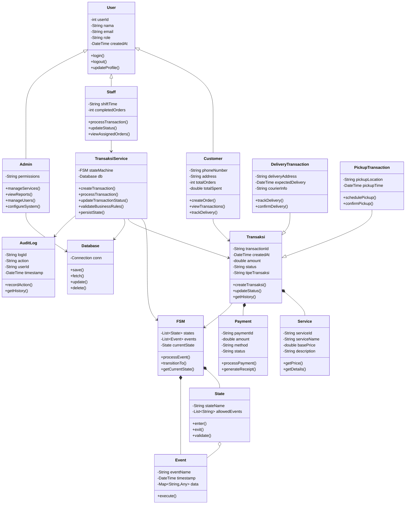

# Class Diagram - Laundry POS System

```mermaid
classDiagram
    class User {
        -int userId
        -String nama
        -String email
        -String role
        -DateTime createdAt
        +login()
        +logout()
        +updateProfile()
    }

    class Customer {
        -String phoneNumber
        -String address
        -int totalOrders
        -double totalSpent
        +createOrder()
        +viewTransactions()
        +trackDelivery()
    }

    class Staff {
        -String shiftTime
        -int completedOrders
        +processTransaction()
        +updateStatus()
        +viewAssignedOrders()
    }

    class Admin {
        -String permissions
        +manageServices()
        +viewReports()
        +manageUsers()
        +configureSystem()
    }

    class Transaksi {
        -String transactionId
        -DateTime createdAt
        -double amount
        -String status
        -String tipeTransaksi
        +createTransaksi()
        +updateStatus()
        +getHistory()
    }

    class TransaksiService {
        -FSM stateMachine
        -Database db
        +createTransaction()
        +processTransaction()
        +updateTransactionStatus()
        +validateBusinessRules()
        +persistState()
    }

    class FSM {
        -List~State~ states
        -List~Event~ events
        -State currentState
        +processEvent()
        +transitionTo()
        +getCurrentState()
    }

    class State {
        -String stateName
        -List~String~ allowedEvents
        +enter()
        +exit()
        +validate()
    }

    class Event {
        -String eventName
        -DateTime timestamp
        -Map~String,Any~ data
        +execute()
    }

    class Service {
        -String serviceId
        -String serviceName
        -double basePrice
        -String description
        +getPrice()
        +getDetails()
    }

    class DeliveryTransaction {
        -String deliveryAddress
        -DateTime expectedDelivery
        -String courierInfo
        +trackDelivery()
        +confirmDelivery()
    }

    class PickupTransaction {
        -String pickupLocation
        -DateTime pickupTime
        +schedulePickup()
        +confirmPickup()
    }

    class Payment {
        -String paymentId
        -double amount
        -String method
        -String status
        +processPayment()
        +generateReceipt()
    }

    class Database {
        -Connection conn
        +save()
        +fetch()
        +update()
        +delete()
    }

    class AuditLog {
        -String logId
        -String action
        -String userId
        -DateTime timestamp
        +recordAction()
        +getHistory()
    }

    User <|-- Customer
    User <|-- Staff
    User <|-- Admin

    Transaksi *-- Service
    Transaksi *-- Payment
    Transaksi --> FSM

    TransaksiService --> FSM
    TransaksiService --> Transaksi
    TransaksiService --> Database
    TransaksiService --> AuditLog

    DeliveryTransaction --|> Transaksi
    PickupTransaction --|> Transaksi

    FSM *-- State
    FSM *-- Event

    State o-- Event

    Customer --> Transaksi
    Staff --> TransaksiService
    Admin --> Database
```
