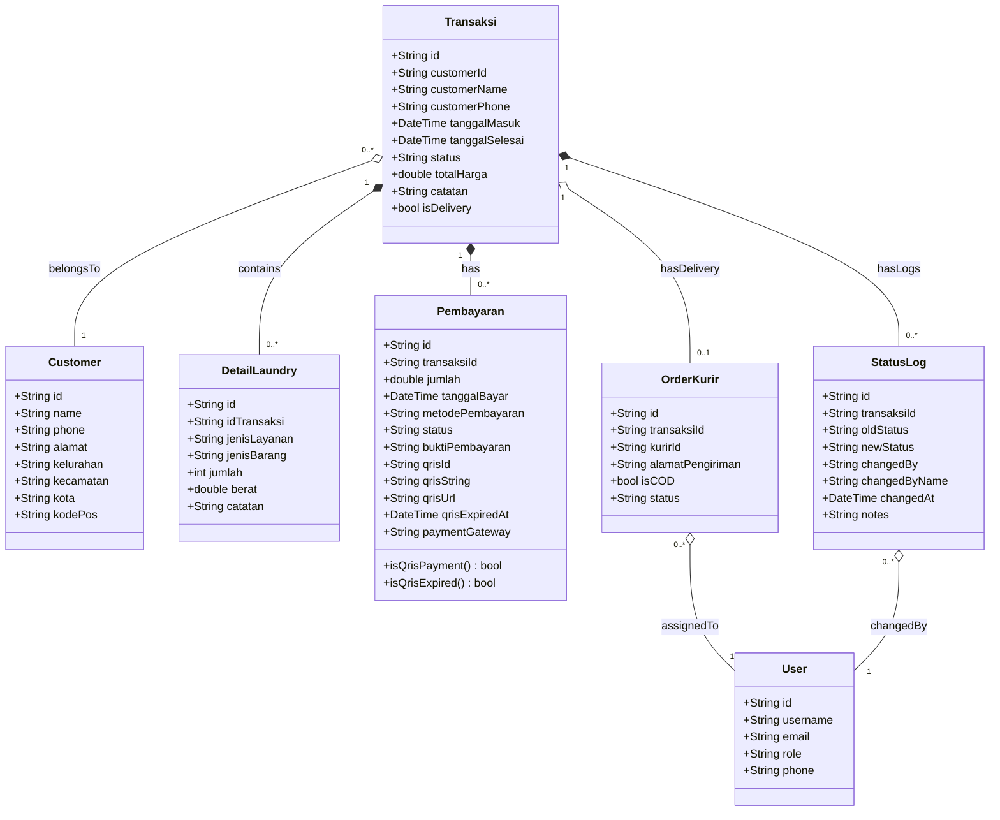
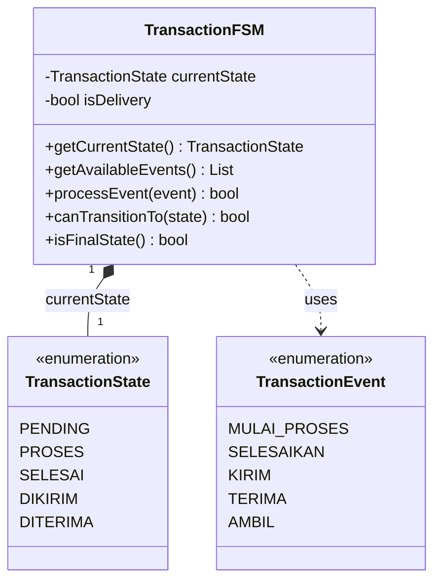
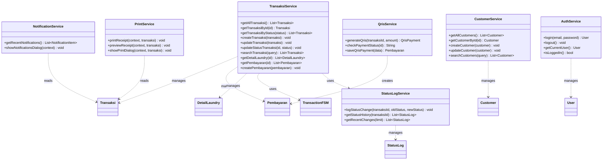
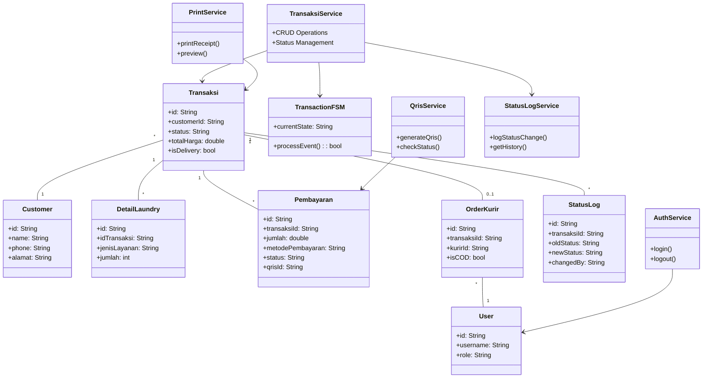

# Class Diagram - Laundry POS System
## Untuk Laporan Kerja Praktik Bab 4

Berikut adalah class diagram yang dibagi menjadi beberapa bagian agar lebih mudah dibaca:

---

## 1. Class Diagram - Model Data (Entity)



---

## 2. Class Diagram - Finite State Machine (FSM)



---

## 3. Class Diagram - Service Layer



---

## 4. Class Diagram Lengkap (Simplified)



---

## Penjelasan Kelas Utama

### Model (Data Layer)
| Kelas | Deskripsi |
|-------|-----------|
| **User** | Data pengguna sistem (Owner, Kasir, Kurir) |
| **Customer** | Data pelanggan laundry |
| **Transaksi** | Data transaksi utama |
| **DetailLaundry** | Detail item dalam transaksi |
| **Pembayaran** | Data pembayaran transaksi (termasuk QRIS) |
| **OrderKurir** | Data penugasan kurir untuk delivery |
| **StatusLog** | Log perubahan status transaksi |

### Finite State Machine
| Kelas | Deskripsi |
|-------|-----------|
| **TransactionState** | Status transaksi (pending, proses, selesai, dikirim, diterima) |
| **TransactionEvent** | Event pemicu transisi status |
| **TransactionFSM** | Mesin pengelola status transaksi |

### Service Layer
| Kelas | Deskripsi |
|-------|-----------|
| **TransaksiService** | Logika bisnis untuk transaksi |
| **CustomerService** | Manajemen data pelanggan |
| **AuthService** | Autentikasi pengguna |
| **QrisService** | Integrasi pembayaran QRIS via Midtrans |
| **StatusLogService** | Logging perubahan status transaksi |
| **NotificationService** | Pengelolaan notifikasi aplikasi |
| **PrintService** | Pencetakan struk/receipt |

---

## Diagram Transisi Status (FSM)

```
┌─────────┐   mulai    ┌─────────┐  selesai   ┌─────────┐
│ PENDING │ ─────────▶ │ PROSES  │ ─────────▶ │ SELESAI │
└─────────┘            └─────────┘            └────┬────┘
                                                   │
                          ┌────────────────────────┴────────────────────────┐
                          │                                                 │
                          ▼ (Delivery)                                      ▼ (Pickup)
                    ┌─────────┐                                       ╔═════════╗
                    │ DIKIRIM │ ──────────────────────────────────▶   ║DITERIMA ║
                    └─────────┘           terima                      ╚═════════╝
```

---

## Metode Pembayaran

Aplikasi mendukung beberapa metode pembayaran:

| Metode | Deskripsi |
|--------|-----------|
| **Cash** | Pembayaran tunai di tempat |
| **Transfer** | Pembayaran via transfer bank |
| **QRIS** | Pembayaran digital via QR code (Midtrans) |
| **COD** | Cash on Delivery (bayar saat diantar kurir) |

