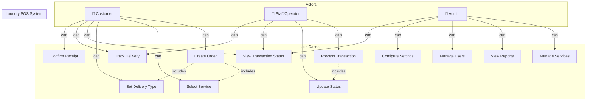

# Use Case Diagram - Laundry POS System

```mermaid
graph TB
    subgraph Aktor["Actors"]
        Customer["👤 Customer"]
        Staff["👤 Staff/Operator"]
        Admin["👤 Admin"]
    end

    subgraph UseCases["Use Cases"]
        UC1["Create Order"]
        UC2["Select Service"]
        UC3["Set Delivery Type"]
        UC4["View Transaction Status"]
        UC5["Process Transaction"]
        UC6["Update Status"]
        UC7["Manage Services"]
        UC8["View Reports"]
        UC9["Manage Users"]
        UC10["Configure Settings"]
        UC11["Track Delivery"]
        UC12["Confirm Receipt"]
    end

    subgraph System["Laundry POS System"]
        UC1
        UC2
        UC3
        UC4
        UC5
        UC6
        UC7
        UC8
        UC9
        UC10
        UC11
        UC12
    end

    Customer -->|can| UC1
    Customer -->|can| UC2
    Customer -->|can| UC3
    Customer -->|can| UC4
    Customer -->|can| UC11
    Customer -->|can| UC12

    Staff -->|can| UC5
    Staff -->|can| UC6
    Staff -->|can| UC4
    Staff -->|can| UC11

    Admin -->|can| UC7
    Admin -->|can| UC8
    Admin -->|can| UC9
    Admin -->|can| UC10
    Admin -->|can| UC4

    UC1 -.->|includes| UC2
    UC1 -.->|includes| UC3
    UC5 -.->|includes| UC6
```
