# Use Case Diagram - Sistem POS Laundry Trias Laundry

## Deskripsi Singkat

Diagram ini menggambarkan interaksi antara aktor-aktor sistem (Owner, Kasir, Kurir) dengan fitur-fitur yang tersedia di aplikasi Laundry POS Trias Laundry.

## Diagram Use Case

```mermaid
flowchart TB
    subgraph Actors
        owner["👔 Owner"]
        kasir["💼 Kasir"]
        kurir["🚚 Kurir"]
    end

    subgraph "Sistem POS Laundry Trias Laundry"
        subgraph AUTH["🔐 Autentikasi"]
            UC_LOGIN["Login<br/><small>/login</small>"]
            UC_LOGOUT["Logout"]
            UC_RESET_PW["Reset Password"]
        end

        subgraph KASIR_MODULE["📋 Modul Kasir"]
            UC_KASIR_DASH["Dashboard Kasir<br/><small>/kasir</small>"]
            UC_TERIMA["Terima Laundry Baru"]
            UC_KELOLA_TRX["Kelola Transaksi"]
            UC_UPDATE_STATUS["Update Status Transaksi"]
            UC_INPUT_BAYAR["Input Pembayaran"]
            UC_QRIS["Generate QRIS"]
            UC_CETAK["Cetak Struk"]
            UC_RIWAYAT["Riwayat Transaksi<br/><small>/kasir/riwayat</small>"]
            UC_PELANGGAN["Kelola Pelanggan<br/><small>/kasir/pelanggan</small>"]
            UC_ASSIGN["Assign Kurir"]
        end

        subgraph KURIR_MODULE["📦 Modul Kurir"]
            UC_KURIR_DASH["Dashboard Kurir<br/><small>/kurir</small>"]
            UC_LIHAT_ORDER["Lihat Order Pengiriman"]
            UC_MULAI["Mulai Pengiriman"]
            UC_UPDATE_KIRIM["Update Status Pengiriman"]
            UC_COD["Terima Pembayaran COD"]
            UC_RIW_KIRIM["Riwayat Pengiriman<br/><small>/kurir/riwayat</small>"]
        end

        subgraph OWNER_MODULE["📊 Modul Owner"]
            UC_OWNER_DASH["Dashboard Owner<br/><small>/owner</small>"]
            UC_OMZET["Lihat Total Omzet"]
            UC_GRAFIK["Lihat Grafik Pendapatan"]
            UC_KELOLA_USER["Kelola User"]
            UC_VERIF_COD["Verifikasi Pembayaran COD"]
            UC_LAPORAN["Lihat Laporan"]
            UC_MONITOR["Monitoring Kasir & Kurir"]
            UC_RESET["Reset Riwayat Transaksi"]
        end

        subgraph BACKEND["☁️ Backend Supabase"]
            UC_AUTH["Autentikasi User"]
            UC_SIMPAN["Simpan Transaksi"]
            UC_PROSES_QRIS["Proses QRIS (Edge Function)"]
            UC_LOG["Log Aktivitas"]
        end
    end

    %% Kasir connections
    kasir --> UC_LOGIN
    kasir --> UC_LOGOUT
    kasir --> UC_KASIR_DASH
    kasir --> UC_TERIMA
    kasir --> UC_KELOLA_TRX
    kasir --> UC_INPUT_BAYAR
    kasir --> UC_CETAK
    kasir --> UC_RIWAYAT
    kasir --> UC_PELANGGAN
    kasir --> UC_ASSIGN

    %% Kurir connections
    kurir --> UC_LOGIN
    kurir --> UC_LOGOUT
    kurir --> UC_KURIR_DASH
    kurir --> UC_LIHAT_ORDER
    kurir --> UC_MULAI
    kurir --> UC_COD
    kurir --> UC_RIW_KIRIM

    %% Owner connections
    owner --> UC_LOGIN
    owner --> UC_LOGOUT
    owner --> UC_OWNER_DASH
    owner --> UC_OMZET
    owner --> UC_GRAFIK
    owner --> UC_KELOLA_USER
    owner --> UC_VERIF_COD
    owner --> UC_LAPORAN
    owner --> UC_MONITOR
    owner --> UC_RESET

    %% Include relationships
    UC_LOGIN -.->|include| UC_AUTH
    UC_TERIMA -.->|include| UC_SIMPAN
    UC_INPUT_BAYAR -.->|extend| UC_QRIS
    UC_QRIS -.->|include| UC_PROSES_QRIS
    UC_KELOLA_TRX -.->|include| UC_UPDATE_STATUS
    UC_MULAI -.->|include| UC_UPDATE_KIRIM
    UC_LOGIN -.->|include| UC_LOG
    UC_UPDATE_STATUS -.->|include| UC_LOG
```

## Daftar Aktor

| Aktor | Deskripsi | Role di Sistem |
|-------|-----------|----------------|
| **Owner** | Pemilik usaha laundry yang memiliki akses penuh ke semua fitur analitik dan manajemen | `owner` |
| **Kasir** | Petugas yang menangani transaksi laundry, pembayaran, dan data pelanggan | `kasir` |
| **Kurir** | Petugas yang menangani pengiriman laundry ke pelanggan | `kurir` |

## Daftar Use Case Berdasarkan Modul

### 1. Modul Autentikasi

| Use Case | Route | Deskripsi |
|----------|-------|-----------|
| Login | `/login` | Proses masuk ke sistem dengan username dan password |
| Logout | - | Proses keluar dari sistem |
| Reset Password | - | Proses reset password melalui email |

### 2. Modul Kasir

| Use Case | Route | Deskripsi |
|----------|-------|-----------|
| Dashboard Kasir | `/kasir` | Halaman utama kasir dengan ringkasan transaksi |
| Terima Laundry Baru | - | Memasukkan transaksi laundry baru |
| Kelola Transaksi | - | Mengelola transaksi yang sedang berjalan |
| Update Status Transaksi | - | Mengubah status transaksi (pending → proses → selesai) |
| Input Pembayaran | - | Memasukkan pembayaran (tunai/transfer/QRIS) |
| Generate QRIS | - | Membuat kode QRIS untuk pembayaran digital |
| Cetak Struk | - | Mencetak struk transaksi dalam format PDF |
| Riwayat Transaksi | `/kasir/riwayat` | Melihat daftar riwayat transaksi |
| Kelola Pelanggan | `/kasir/pelanggan` | Mengelola data pelanggan |
| Assign Kurir | - | Menugaskan kurir untuk pengiriman |

### 3. Modul Kurir

| Use Case | Route | Deskripsi |
|----------|-------|-----------|
| Dashboard Kurir | `/kurir` | Halaman utama kurir dengan daftar pengiriman |
| Lihat Order Pengiriman | - | Melihat order yang ditugaskan |
| Mulai Pengiriman | - | Memulai proses pengiriman |
| Update Status Pengiriman | - | Mengubah status pengiriman |
| Terima Pembayaran COD | - | Menerima pembayaran COD dari pelanggan |
| Riwayat Pengiriman | `/kurir/riwayat` | Melihat riwayat pengiriman yang telah selesai |

### 4. Modul Owner

| Use Case | Route | Deskripsi |
|----------|-------|-----------|
| Dashboard Owner | `/owner` | Halaman utama owner dengan analitik bisnis |
| Lihat Total Omzet | - | Melihat total pendapatan keseluruhan |
| Lihat Grafik Pendapatan | - | Melihat grafik pendapatan harian/bulanan |
| Kelola User | - | Mengelola data kasir dan kurir |
| Verifikasi Pembayaran COD | - | Memverifikasi pembayaran COD dari kurir |
| Lihat Laporan | - | Melihat laporan bisnis |
| Monitoring Kasir & Kurir | - | Memantau aktivitas kasir dan kurir |
| Reset Riwayat Transaksi | - | Menghapus riwayat transaksi (untuk testing) |

## Relasi Use Case

### Include Relationships
- **Login** → Autentikasi User (setiap login memerlukan autentikasi Supabase)
- **Terima Laundry Baru** → Simpan Transaksi (setiap transaksi baru disimpan ke database)
- **Generate QRIS** → Proses QRIS via Edge Function (QRIS diproses melalui Midtrans)
- **Kelola Transaksi** → Update Status Transaksi (perubahan status adalah bagian dari pengelolaan)
- **Login/Update Status** → Log Aktivitas (setiap aksi penting dicatat dalam log)

### Extend Relationships
- **Input Pembayaran** → Generate QRIS (opsional jika metode pembayaran QRIS dipilih)
