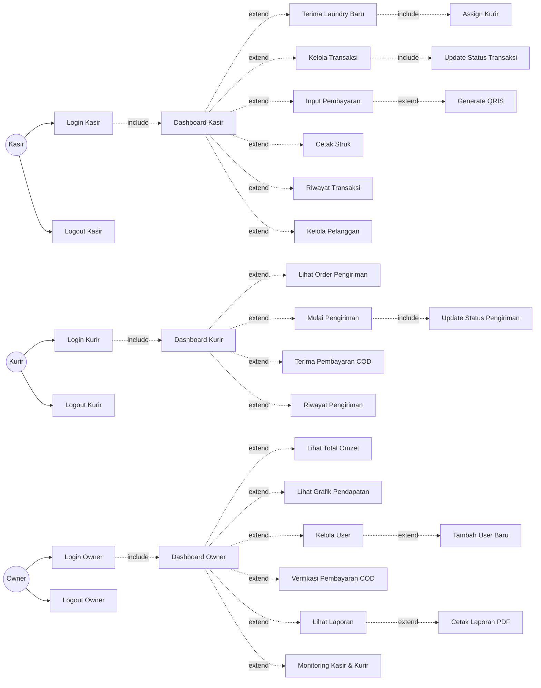

# Use Case Diagram - Sistem POS Laundry Trias Laundry (Per Role)

## Deskripsi

Diagram ini menggambarkan use case per role dengan pola:
- **Login** → include → **Dashboard** → extend → **Fitur-fitur**

## Diagram Use Case



## Penjelasan Struktur

### Pola Dasar per Role

Setiap role mengikuti pola yang sama:

```
Aktor → Login → include → Dashboard → extend → Fitur-fitur
```

### Role: Kasir

**Alur Utama:**
1. Kasir melakukan **Login Kasir**
2. Login **include** → **Dashboard Kasir** (otomatis masuk dashboard)
3. Dashboard **extend** ke fitur-fitur:
   - Terima Laundry Baru → include → Assign Kurir
   - Kelola Transaksi → include → Update Status Transaksi
   - Input Pembayaran → extend → Generate QRIS
   - Cetak Struk
   - Riwayat Transaksi
   - Kelola Pelanggan

**Relasi Include & Extend:**
- `Login Kasir --include--> Dashboard Kasir` (wajib)
- `Dashboard --extend--> Fitur-fitur` (opsional, sesuai kebutuhan)
- `Kelola Transaksi --include--> Update Status` (wajib)
- `Input Pembayaran --extend--> Generate QRIS` (opsional jika pilih QRIS)

### Role: Kurir

**Alur Utama:**
1. Kurir melakukan **Login Kurir**
2. Login **include** → **Dashboard Kurir**
3. Dashboard **extend** ke fitur-fitur:
   - Lihat Order Pengiriman
   - Mulai Pengiriman → include → Update Status Pengiriman
   - Terima Pembayaran COD
   - Riwayat Pengiriman

**Relasi Include & Extend:**
- `Login Kurir --include--> Dashboard Kurir` (wajib)
- `Dashboard --extend--> Fitur-fitur` (opsional)
- `Mulai Pengiriman --include--> Update Status Pengiriman` (wajib)

### Role: Owner

**Alur Utama:**
1. Owner melakukan **Login Owner**
2. Login **include** → **Dashboard Owner**
3. Dashboard **extend** ke fitur-fitur:
   - Lihat Total Omzet
   - Lihat Grafik Pendapatan
   - Kelola User → extend → Tambah User Baru
   - Verifikasi Pembayaran COD
   - Lihat Laporan → extend → Cetak Laporan PDF
   - Monitoring Kasir & Kurir

**Relasi Include & Extend:**
- `Login Owner --include--> Dashboard Owner` (wajib)
- `Dashboard --extend--> Fitur-fitur` (opsional)
- `Lihat Laporan --extend--> Cetak Laporan PDF` (opsional)
- `Kelola User --extend--> Tambah User Baru` (opsional)

## Perbedaan Include vs Extend

| Relasi | Keterangan | Contoh |
|--------|------------|--------|
| **Include** | Use case yang **wajib** dilakukan | Login → Dashboard (pasti masuk dashboard setelah login) |
| **Extend** | Use case yang **opsional** | Dashboard → Fitur (tidak semua fitur diakses setiap kali) |

## Daftar Use Case per Role

### Kasir (11 use cases)
1. Login Kasir
2. Logout Kasir
3. Dashboard Kasir
4. Terima Laundry Baru
5. Kelola Transaksi
6. Update Status Transaksi
7. Input Pembayaran
8. Generate QRIS
9. Cetak Struk
10. Riwayat Transaksi
11. Kelola Pelanggan
12. Assign Kurir

### Kurir (6 use cases)
1. Login Kurir
2. Logout Kurir
3. Dashboard Kurir
4. Lihat Order Pengiriman
5. Mulai Pengiriman
6. Update Status Pengiriman
7. Terima Pembayaran COD
8. Riwayat Pengiriman

### Owner (10 use cases)
1. Login Owner
2. Logout Owner
3. Dashboard Owner
4. Lihat Total Omzet
5. Lihat Grafik Pendapatan
6. Kelola User
7. Tambah User Baru
8. Verifikasi Pembayaran COD
9. Lihat Laporan
10. Cetak Laporan PDF
11. Monitoring Kasir & Kurir
